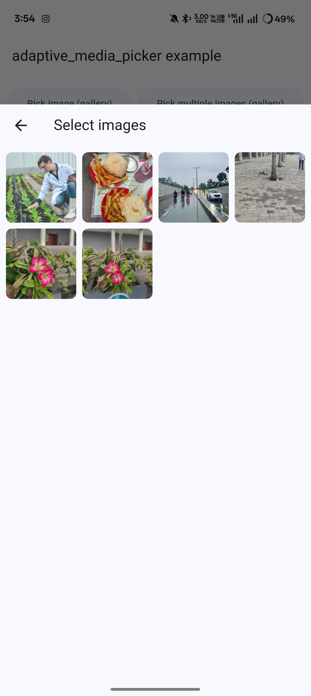
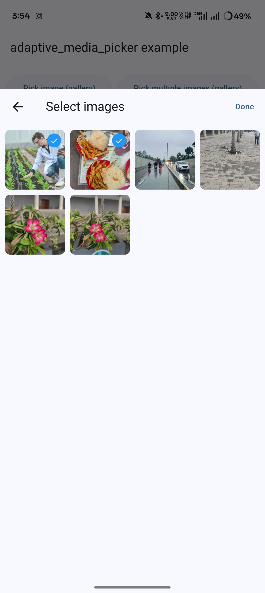
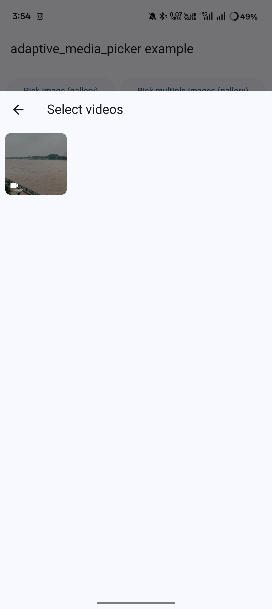

# 📸 Adaptive Media Picker

<p align="center">
  <a href="https://pub.dev/packages/adaptive_media_picker"></a>
  <a href="https://github.com/jaimin-kavathia/adaptive_media_picker/actions/workflows/ci.yml"></a>
  <a href="https://opensource.org/licenses/MIT"></a>
  
</p>

<p align="center">
  <strong>🚀 Adaptive, permission-aware media picker for Flutter</strong><br/>
  <em>Handles limited & full access gracefully — with native-like UX on Android, iOS, Web, and Desktop.</em>
</p>

---

## ✨ Why Adaptive Media Picker?

Most media pickers only open the gallery or camera — but fail when permissions are **limited** or **restricted**.
`adaptive_media_picker` is designed to **handle every case automatically**, making your UX seamless.

### 💡 What makes it different?

- ✅ Auto permission handling
- ✅ Built-in **limited-access sheet** (for iOS & Android)
- ✅ Optional **image cropping** (Android / iOS / Web)
- ✅ Works seamlessly on **Web, Desktop, and Mobile**
- ✅ **Single unified API** for images & videos

<p align="center">
  
  
  
</p>

<p align="center">
  <em>✨ Built-in limited access bottom sheet UI (native full-access flow on Android/iOS)</em>
</p>

---

## 🚀 Features at a Glance

| Feature                        | Description                                  |
| :----------------------------- | :------------------------------------------- |
| 📷 Image & Video Picker        | Pick single/multiple images or single videos |
| ✂️ Cropping                    | Optional crop (Android, iOS, Web)            |
| 🔐 Permission-aware            | Handles full, limited, denied states         |
| 🧭 Cross-platform              | Works on mobile, web, and desktop            |
| 🖼️ Built-in Limited Access UI | Native-like bottom sheet                     |
| 🧩 Fallbacks                   | Smart fallbacks for unsupported platforms    |
| 🎯 Web Safe                    | No `dart:io` — works on Flutter Web          |

> ⚠️ Multiple video selection is **not supported** by native APIs.

---

## 🗂️ Platform Support Matrix

| Feature                 | Android | iOS | Web | macOS | Windows | Linux |
| ----------------------- | :-----: | :-: | :-: | :---: | :-----: | :---: |
| Single image pick       |    ✅    |  ✅  |  ✅  |   ✅   |    ✅    |   ✅   |
| Multi-image pick        |    ✅    |  ✅  |  ✅  |   ✅   |    ✅    |   ✅   |
| Single video pick       |    ✅    |  ✅  |  ✅  |   ✅   |    ✅    |   ✅   |
| Multiple videos         |    ❌    |  ❌  |  ❌  |   ❌   |    ❌    |   ❌   |
| Camera capture          |    ✅    |  ✅  |  ❌  |   ❌   |    ❌    |   ❌   |
| Limited-access UX       |    ✅    |  ✅  |  ❌  |   ✅   |    ❌    |   ❌   |
| Cropping (single image) |    ✅    |  ✅  |  ✅  |   ❌   |    ❌    |   ❌   |

---

## ⚡ Quick Start

```dart
final picker = AdaptiveMediaPicker();

// Pick a single image
final singleImage = await picker.pickImage(
  context: context,
  options: const PickOptions(source: ImageSource.gallery, imageQuality: 80),
);

// Pick and crop
final croppedImage = await picker.pickImage(
  context: context,
  options: const PickOptions(source: ImageSource.gallery, wantToCrop: true),
);

// Pick multiple images
final multiImages = await picker.pickMultiImage(
  context: context,
  options: const PickOptions(maxImages: 5, source: ImageSource.gallery),
);

// Pick a single video
final singleVideo = await picker.pickVideo(
  context: context,
  options: const PickOptions(source: ImageSource.gallery),
);
```

---

## 📌 Common Use Cases

* 🖼️ Select & crop a profile picture
* 📸 Capture or choose multiple images for a gallery/post
* 🎥 Pick single video from camera or gallery
* 🔐 Handle **limited access** permissions gracefully

---

## ✂️ Cropping Setup

Cropping is supported on **Android**, **iOS**, and **Web**.

### 📱 Android

Add `UCropActivity` to your `AndroidManifest.xml`:

```xml
<activity
  android:name="com.yalantis.ucrop.UCropActivity"
  android:screenOrientation="portrait"
  android:theme="@style/Theme.AppCompat.Light.NoActionBar"/>
```

> ✅ Android embedding v2 required

### 🍏 iOS

No additional setup required.

### 🌐 Web

Add **cropperjs** to `web/index.html`:

```html
<link
  rel="stylesheet"
  href="https://cdnjs.cloudflare.com/ajax/libs/cropperjs/1.6.2/cropper.css"
/>
<script src="https://cdnjs.cloudflare.com/ajax/libs/cropperjs/1.6.2/cropper.min.js"></script>
```

---

## 🔐 Limited Access UX

When the user grants **limited access**, the picker automatically shows a native-like dialog with options:

* 📁 **Manage Selection** (iOS only)
* ⚙️ **Open Settings** (iOS/macOS/Android)
* 🕓 Auto-dismisses after interaction

---

## ⚙️ Permissions Setup

### 🧱 Android

```xml
<uses-permission android:name="android.permission.READ_MEDIA_IMAGES" />
<uses-permission android:name="android.permission.READ_MEDIA_VIDEO" />
<uses-permission android:name="android.permission.READ_EXTERNAL_STORAGE" />
<uses-permission android:name="android.permission.CAMERA" />
<uses-permission android:name="android.permission.RECORD_AUDIO" />
```

### 🍎 iOS

```xml
<key>NSPhotoLibraryUsageDescription</key>
<string>This app needs photo library access to pick images.</string>
<key>NSCameraUsageDescription</key>
<string>This app needs camera access to take photos and videos.</string>
<key>NSMicrophoneUsageDescription</key>
<string>This app needs microphone access when recording videos.</string>
<key>NSPhotoLibraryAddUsageDescription</key>
<string>This app may save images/videos to your photo library.</string>
```

### 💻 macOS

```xml
<key>com.apple.security.files.user-selected.read-only</key>
<true/>
```

> 🧩 Desktop platforms use native file dialogs.
> Camera capture is not supported on desktop.

---

## 🧩 API Overview

| Method             | Description                            |
| :----------------- | :------------------------------------- |
| `pickImage()`      | Pick single image (optionally cropped) |
| `pickMultiImage()` | Pick multiple images                   |
| `pickVideo()`      | Pick single video                      |

## 📘 Data Models Overview

### 🧩 **PickOptions**

Configuration options for image/video picking operations.

| Field                    | Type          | Description                                                                    |
| :----------------------- | :------------ | :----------------------------------------------------------------------------- |
| `maxImages`              | `int?`        | Maximum number of images for multi-image pick. Ignored for single image/video. |
| `imageQuality`           | `int?`        | JPEG compression quality (0–100).                                              |
| `maxWidth`               | `int?`        | Resize width for images when supported.                                        |
| `maxHeight`              | `int?`        | Resize height for images when supported.                                       |
| `source`                 | `ImageSource` | Source — `gallery` or `camera`. Falls back to gallery on web/desktop.          |
| `showOpenSettingsDialog` | `bool`        | Show “Open Settings” dialog when permission is permanently denied.             |
| `settingsDialogTitle`    | `String?`     | Custom title for the settings dialog.                                          |
| `settingsDialogMessage`  | `String?`     | Custom message for the settings dialog.                                        |
| `settingsButtonLabel`    | `String?`     | Label for the confirm button.                                                  |
| `cancelButtonLabel`      | `String?`     | Label for the cancel button.                                                   |
| `wantToCrop`             | `bool`        | Enable crop flow (Android/iOS/Web only, single image only).                    |
| `logTag`                 | `String?`     | Optional debug tag for internal logging.                                       |

---

### 🖼️ **PickedMedia**

Represents a single picked image or video.

| Field      | Type      | Description                          |
| :--------- | :-------- | :----------------------------------- |
| `path`     | `String`  | Local file path to the picked media. |
| `mimeType` | `String?` | MIME type if available.              |
| `width`    | `int?`    | Image width (when known).            |
| `height`   | `int?`    | Image height (when known).           |

---

### 🧾 **PickResultSingle**

Returned from `pickImage()` or `pickVideo()`.

| Field                  | Type                   | Description                                |
| :--------------------- | :--------------------- | :----------------------------------------- |
| `item`                 | `PickedMedia?`         | Picked item, or `null` if none.            |
| `permissionResolution` | `PermissionResolution` | Final permission state after operation.    |
| `metadata`             | `PickMetadata`         | Metadata about crop and sizes.             |
| `error`                | `PickError?`           | Indicates if operation failed or canceled. |

> 💡 Use `.isEmpty` to check if no item was selected.

---

### 🧾 **PickResultMultiple**

Returned from `pickMultiImage()`.

| Field                  | Type                   | Description                       |
| :--------------------- | :--------------------- | :-------------------------------- |
| `items`                | `List<PickedMedia>`    | All picked images. Empty if none. |
| `permissionResolution` | `PermissionResolution` | Final permission state.           |

> 💡 Use `.isEmpty` to check if no images were selected.

---

### 🧠 **PickMetadata**

Extra info for debugging and analytics.

| Field          | Type    | Description                   |
| :------------- | :------ | :---------------------------- |
| `cropApplied`  | `bool`  | Whether cropping was applied. |
| `originalSize` | `Size?` | Size before transformations.  |
| `finalSize`    | `Size?` | Size after transformations.   |

---

### ⚠️ **PickError**

Typed error codes for single-pick operations.

| Value          | Description              |
| :------------- | :----------------------- |
| `canceled`     | User canceled selection. |
| `cropCanceled` | User canceled cropping.  |
| `io`           | I/O or platform failure. |
| `unknown`      | Unknown reason.          |

---

### 🔐 **PermissionResolution**

Represents the final permission outcome.

| Field               | Type   | Description                                  |
| :------------------ | :----- | :------------------------------------------- |
| `granted`           | `bool` | True if any form of access was granted.      |
| `limited`           | `bool` | True if access is limited (iOS/Android 14+). |
| `permanentlyDenied` | `bool` | True if user must change settings manually.  |

#### Factories

| Factory                                 | Description                           |
| :-------------------------------------- | :------------------------------------ |
| `PermissionResolution.grantedFull()`    | Full access granted.                  |
| `PermissionResolution.grantedLimited()` | Limited access granted.               |
| `PermissionResolution.denied()`         | Access denied (optionally permanent). |

---

## 👤 Author

Created with ❤️ by [**Jaimin Kavathia**](https://jaimin-kavathia.github.io/) - 💼 [LinkedIn](https://in.linkedin.com/in/jaimin-kavathia-flutter-developer)

---

## 📜 License

Licensed under the [**MIT License**](LICENSE).
Free for personal & commercial use.

---

<p align="center">
  ⭐ <strong>If you like this package, give it a star on <a href="https://github.com/jaimin-kavathia/adaptive_media_picker">GitHub</a> & <a href="https://pub.dev/packages/adaptive_media_picker">pub.dev</a>!</strong>
</p>